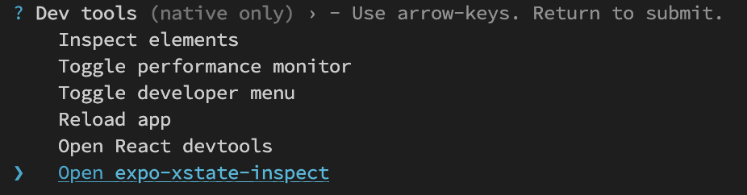
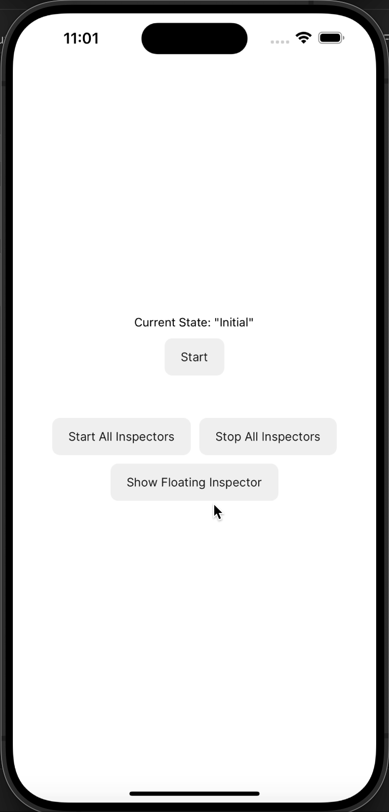

## React Native Xstate Inspector

Inspect your V5 xstate machines using [StatelyAI's inspect tool](https://stately.ai/blog/2024-01-15-stately-inspector/) with React Native and Expo apps

See the [Demo App](./packages/demo-app/App.tsx) for reference implementation

# Expo Dev Tool Plugin

##### Activate the plugin by pressing Shift + 'm' in the expo packager terminal and select `expo-xstate-inspect`



This should open up the inpsector in a web browser


##### See the [README](./packages/plugin/README.md) for implementation details. 


## In-App Floating Inspector 
This should work for all React Native projects (not only Expo)





See the [floating-inspector README](./packages/floating-inspector/README.md) for info on how to use the in-app floating inspector. 


### Using multiple inspectors
You can use both inspectors by using the `combineObservers` helper function.


```typescript
import { combineObservers } from "react-native-xstate-inspect-shared";

// your component
const inspectors = [expoPluginInspector, floatingInspector];
const combinedInspectors = useMemo(() => {
return combineObservers(inspectors);
}, [expoPluginInspector, floatingInspector]);

const [state, send] = useMachine(DemoMachine, {
inspect: combinedInspectors,
});

```

See the [Demo App](./packages/demo-app/App.tsx) for reference implementation

#### Todo Tasks
- [ ] (Floating Inspector) - Zoom buttons appear on Android but not iOS. Fix this.
- [ ] (Floating Inspector) - Show loading indicator when webview is loading inspector. (show error view if offline)
- [ ] (Floating Inspector) - Test memory leaks
- [ ] (Floating Inspector) - Expose the WebViewInspector as a standalone component (not floating)
- [ ] (Floating Inspector) - Consider clamping/bounding the floating window to device screen. (similar to [this](https://snack.expo.dev/@fakeheal/pan-gesture-on-a-scaled-view))
- [ ] (Both) - listen for hot/live reload, so we can reload the inspectors


# Contributing

Contributions are very welcome!


#### Notes: 
@statelyai/inspect is using a very old version of partysocket (0.25). I added a dependency on their latest version (1.0) to address some of the [react native issues](https://github.com/partykit/partykit/issues/232) ([another issue](https://github.com/partykit/partykit/issues/516))
